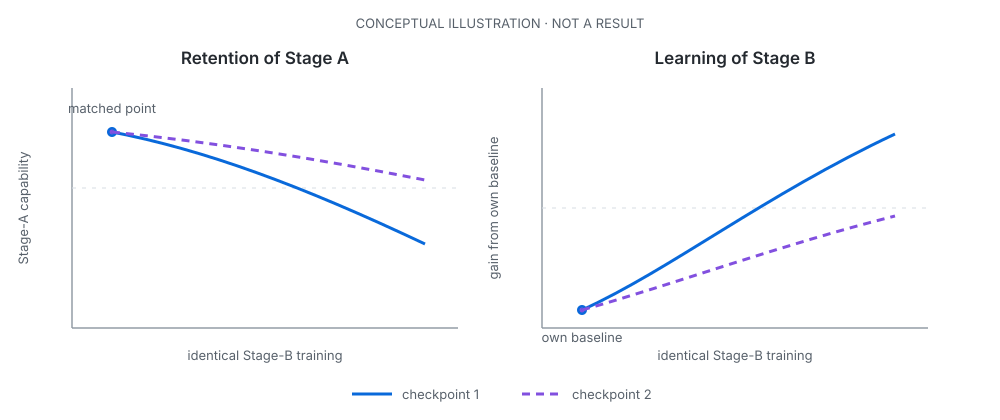

# DuraSeed

**Can two models with the same measured capability have different futures because of how they learned it?**

Modern models are trained repeatedly: one skill is acquired, then later training
changes the same weights. Immediate benchmark accuracy may not fully
characterize a checkpoint if equally capable models respond differently to what
comes next. DuraSeed follows those checkpoints forward under identical
subsequent training.


## Why this matters

A benchmark score is a snapshot. In a multi-stage training pipeline, we also
care about trajectory: whether a newly learned ability survives, whether the
model remains ready to learn something else, and whether inexpensive
measurements can predict either outcome.

Nearby studies compare how much pre-existing ability is lost while a skill is
being learned by SFT versus RL. DuraSeed instead holds the subsequent training
identical and asks whether the newly acquired skill's durability — and the
model's readiness for the next task — depends on how it was acquired.

The aim is not a universal verdict on SFT or RL. It is a controlled test of
whether two concrete acquisition procedures can produce checkpoints that look
equally capable now but behave differently later.

## The experiment

### A common origin

Both methods start from **M0**, a format-capable checkpoint derived from
`Qwen/Qwen3.5-9B-Base` with a rank-32 LoRA adapter. Each branch restores the
same weights and starts with a fresh optimizer. M0 is task-cold for the Stage-A
skill; it is not an untouched pretrained model.

### Stage A: two ways to acquire one capability

Stage A is an exact arithmetic-expression task: use each supplied number once
to reach a target value. A deterministic verifier scores every attempt, so
there is no judge model or subjective partial credit.

- **B-S** learns fixed, correct solver derivations through supervised
  fine-tuning.
- **B-G** samples its own attempts and learns from exact verifier rewards
  through on-policy group-relative reinforcement learning.

B-S and B-G are complete procedures, not a loss-function-only comparison.
They differ in training source, exploration, and compute as well as objective.
Across paired seeds, two matched 12-family panels exchange the trained-target
and held-out-sentinel roles.

### Match real checkpoints

Both branches are evaluated and checkpointed every ten updates. After Stage A,
the analysis selects the nearest real B-S/B-G checkpoint pair whose measured
targeted-capability intervals overlap. There is no interpolation and no seed
replacement. If no overlapping pair exists, matching is reported as
unavailable and Stage B does not run for that pair.

Matching is deliberately narrow: it aligns measured targeted capability, not
the whole skill or the models' internal states.

### Stage B: identical later training

The selected checkpoints continue their learned LoRA weights into the same
supervised modular program-synthesis task, each with a fresh optimizer. During
Stage B, DuraSeed measures:

- **F1 — retention:** the trajectory of Stage-A capability as later training
  proceeds;
- **F2 — future learning:** Stage-B learning, reported both absolutely and
  relative to each checkpoint's own pre-Stage-B baseline; and
- **F3 — pre-Stage-B profile:** target and sentinel accuracy, family coverage,
  invalid and length-stopped outputs, completion length, supported Pass@k,
  verified strategy diversity, token surprisal, and baseline Stage-B
  performance.



*Conceptual illustration, not a result. The checkpoint labels are intentionally
method-neutral: either ordering is possible, and retention and learning need
not move together.*

## Status

The design and measurement pipeline are frozen. Pilot 0 pair 1 (seed `11`) is
through Stage A: both acquisition trajectories are complete, and the frozen
overlap rule matched the real B-S update-140 checkpoint with the real B-G
update-30 checkpoint. Both pre-Stage-B F3 profiles are complete, and the common
Stage-B probe is running: the B-S branch has reached update 5 of 480, with B-G
to follow under the identical schedule. Live operational detail is kept in
[`docs/STATUS.md`](docs/STATUS.md).

> **No retention or future-learning contrast is claimed yet.**

Pre-Pilot work simplified the experiment: algebraically equivalent task
families were removed, an unstable shared teacher warm start was retired in
favor of the literal M0 origin, and a response-format measurement was aligned
with the task's prompt and verifier. These were feasibility and measurement
corrections made before Pilot comparisons, not scientific outcomes; the full
record is in the [technical appendix](docs/TECHNICAL.md).

Next, the project will:

- run the separately authorized second pair once the first yields durable,
  complete artifacts — an authorization that does not depend on the direction
  or size of any scientific result ([docs/STATUS.md](docs/STATUS.md) records
  this commitment);
- use the two pairs to assess feasibility and effect direction, with a first,
  crude look at seed-to-seed variability; and
- add fresh paired seeds before fixing any powered confirmatory study.

## What would be informative

A difference in Stage-A durability would suggest that matching immediate
capability does not match resistance to later change. A difference in Stage-B
learning would suggest that acquisition also changes the substrate available
for the next task. Together, these outcomes could expose a stability–plasticity
tradeoff that endpoint accuracy misses.

A robust null would also be useful: it would place a concrete bound on how much
these two procedures matter under this setup. So would an inexpensive F3
measurement that reliably predicts later retention or learning. DuraSeed does
not assume either method will win.

## Scope

The first study covers one 9B model, rank-32 LoRA adapters, synthetic exact
tasks, and one downstream probe. Its conclusions are therefore about the
complete B-S and B-G procedures in this setting; they cannot isolate the loss
function alone or establish that one broad method family is universally
better.

## Reproduce and inspect

Local setup and validation are credential-free:

```bash
uv sync --extra dev
uv run pytest
uv run duraseed validate
```

- [`PROTOCOL.md`](PROTOCOL.md) — scientific design and estimands
- [`docs/TECHNICAL.md`](docs/TECHNICAL.md) — implementation, calibration, and
  process detail
- [`docs/STATUS.md`](docs/STATUS.md) — current experimental state
- [`docs/MAP.md`](docs/MAP.md) — code, artifacts, and provenance map

## Development and support

DuraSeed is an independent, agent-assisted research project and a learning
experience. Codex handles much of the coding; the scope and implementation
have been deliberately narrowed to keep the repository compact and the
science legible. Constructive input on the design, analysis, implementation,
or presentation is welcome through
[GitHub Issues](https://github.com/ely2ba/duraseed/issues).

This work was made possible by a generous **$5,000 research grant from
[Thinking Machines Lab](https://thinkingmachines.ai/)**.

Licensed under the [Apache License 2.0](LICENSE).
