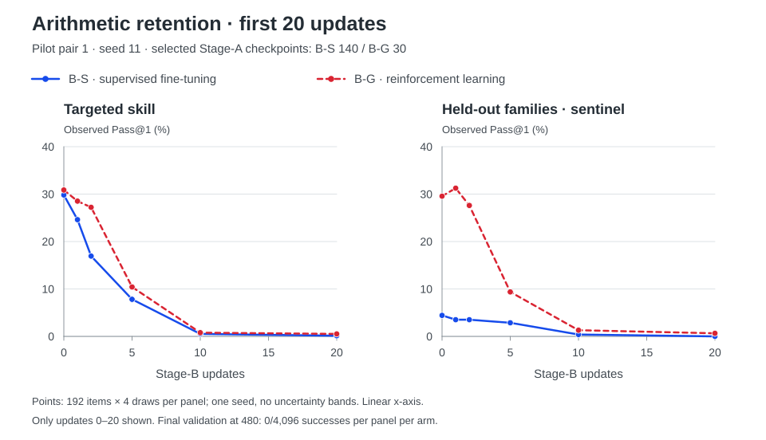
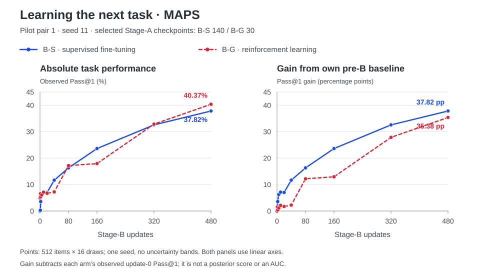

# DuraSeed

**Can models that score similarly today learn — and forget — differently tomorrow?**

DuraSeed teaches the same starting model an arithmetic skill in two ways,
selects checkpoints with similar measured scores, then gives both identical
training on a new task. We follow what happens to the old skill and how quickly
the new one develops.

**30 August 2026:** the first paired pilot is complete; the second is running.
The results below are from **one paired seed**, not a general verdict on
supervised learning versus reinforcement learning.

## The idea

A benchmark score is a snapshot. Models are trained repeatedly, so we also
care about what a checkpoint is ready for: will its skills survive later
training, and can it learn something else?

Nearby work asks how much pre-existing ability is lost *while* a skill is
learned by supervised fine-tuning (SFT) or reinforcement learning (RL).
DuraSeed follows the acquired skill into the *next* training stage, holding
that later training identical.


## How the experiment works

**Learn an arithmetic skill — Stage A.** Both branches start from the same
format-capable Qwen3.5-9B-Base checkpoint, called M0, with fresh optimizers.
Training changes a rank-32 LoRA adapter: a small set of trainable weights
attached to the model. M0 has prior output-format training, but no task-specific
arithmetic warm start.

The task is to reach a target value using each supplied number once.
An exact verifier checks the answer; there is no judge model.

- **B-S (SFT)** learns from fixed, verified solver derivations.
- **B-G (RL)** generates attempts and learns from verifier rewards through
  group-relative reinforcement learning.

These are two complete training procedures. Their examples, exploration,
learning rates, and training budgets differ — this does not isolate the loss
function alone.

**Match checkpoints.** Every ten updates, we save and evaluate each branch.
After Stage A, a frozen rule selects real checkpoints with the closest
targeted scores whose uncertainty intervals overlap. Matching is unavailable
if no pair qualifies; there is no seed replacement. It matches one measured
capability, not the models' entire behavior.

**Train on something new — Stage B.** The selected checkpoints keep their
learned adapters, reset their optimizers, and receive the same 480-update
supervised program-synthesis training. We measure:

- **F1 — retention:** how arithmetic performance changes during later training.
- **F2 — future learning:** performance on the new task, both as an absolute
  score and as improvement from each model's own starting point.
- **F3 — starting profile:** before Stage B, a fuller picture of accuracy,
  held-out families, output length and validity, solution diversity, and
  initial performance on the new task.

## First pilot results

In one sentence: the two checkpoints were matched on score and on almost
nothing else. Before any later training, B-G already solved 223 of 512
new-task problems at least once in 16 attempts; B-S solved none. Under
identical training, both lost nearly all measured arithmetic performance
within ten updates, B-S about 1.5× faster by an exploratory targeted
half-life. On the new task, B-S improved more over the course of training,
while B-G finished higher. One paired seed: a direction, not a verdict.

Pair 1 uses seed `11`. The matching rule selected **B-S at update 140** and
**B-G at update 30**: both scored **31/96** on the matching panel.
On a separate, higher-draw targeted evaluation, their scores were **33.62%**
and **30.98%**. Similar matching scores are not proof of equal capability.

The figures below show observed single-attempt success rates (*Pass@1*) and
changes from baseline, using the saved evaluations.
The [detailed results](docs/results/pilot0-pair1.md) include counts, uncertainty
intervals, both starting profiles, and the exploratory follow-up analyses.
Monitoring and higher-draw validation use separate item panels, so their
starting percentages need not match.

### The old skill: the difference is early, not at the endpoint (F1)



On the targeted monitor, B-S starts at **29.82%** and B-G at **30.86%**.
After two updates on the new task, they score **16.93%** and **27.21%**.
That update-2 gap of **10.3 points** has a paired item-bootstrap 95%
interval of **5.7 to 15.0 points**. An exploratory half-life — updates
until targeted success falls to half its starting value, interpolated
between evaluations — is **2.7 for B-S** and **4.1 for B-G**. By update
ten the gap has narrowed because both scores are near zero: **0.52%**
and **0.78%**.

At the final update-480 evaluation, each branch records **0/4,096 successes**
on targeted arithmetic items and another **0/4,096** on held-out families.
That is zero observed success under this evaluation, not proof that every
trace of the ability has disappeared.

### The new skill: final score and improvement tell different stories (F2)



Before any Stage-B training, B-G solved **223 of the 512** new-task
problems at least once in 16 attempts (**4.99%** of individual attempts);
B-S solved none in **8,192 attempts**. After 480 identical training
updates, B-G reaches **40.37%** and B-S **37.82%**.

The ordering reverses for the frozen summary of **improvement over the whole
training run**. This averages the learning curve above each branch's own
baseline, rather than comparing just its endpoint. On the study's smoothed
score, that average gain is **0.2469 for B-S** and **0.1899 for B-G**.

Both differences are clearly nonzero on item resampling: the endpoint
favors B-G (**2.55 points**, 95% interval **0.77 to 4.35**); the
improvement summary favors B-S (difference **0.057**, 95% interval
**0.047 to 0.067**). Which checkpoint "learned the new task better"
depends on whether you ask about the destination or the path.
The exact definition and interval are in the [results note](docs/results/pilot0-pair1.md#f2--subsequent-maps-learning).

These intervals resample shared evaluation items. They do **not** tell us how
much the result will vary across independently trained seed pairs.

### A similar target score leaves large differences elsewhere (F3)

Before Stage B, the higher-draw profiles show:

- **Held-out arithmetic success:** 4.17% for B-S, 31.64% for B-G.
- **Targeted response length:** a median of 78 tokens for B-S, 1,464 for B-G.
  The 4,096-token cap is reached in 1.98% and 30.32% of attempts.
- **Verified solution variety:** 40 versus 542 distinct strategy families
  among successful targeted completions, from 4,096 attempts per branch.
  These count verifier-defined expression structures, not inferred reasoning
  processes.

LoRA writes its update as a product of two matrices, **B·A**. At the
matched checkpoints the B factor is **7.4× larger in B-S**, measured
by aggregate Frobenius norm, and the update is concentrated in fewer
directions. This describes the saved parameters; it is not evidence
that parameter scale caused the curves.

B-G's new-task score stayed near 7% for the first 40 updates, then
jumped from **7.23% to 17.18%** by update 80, while B-S generally
climbed. The proposed explanation — B-G's long outputs hitting the
new task's **128-token cap** — does not fit the recorded failures:
at evaluated checkpoints from update 1 onward, its cap or format
failures are essentially zero, and most failures are well-formed programs
with the wrong answer. B-S did have substantial early format failures;
its cap and format counts are zero at the evaluated checkpoints
from update ten onward.

## What comes next

**Pair 2 (seed `29`) is running under the same frozen recipe.** The two
12-family panels exchange trained-target and held-out roles across the pairs.
Its authorization did not depend on the direction or size of pair-1 results;
the commitment is recorded in [STATUS.md](docs/STATUS.md).

The two pairs will assess feasibility and effect direction, with a first,
crude look at seed-to-seed variability. More fresh paired seeds are needed
before a powered confirmatory study; neither these item-level intervals nor
two pairs replace that step.

One candidate follow-up asks whether **adapter scale changes the effective
speed of later learning**, even with the same nominal learning rate.
We can test that by rescaling LoRA's two factors in opposite directions:
the model's starting function stays fixed, while its parameterization changes.
A prediction linking larger B-factor scale to faster early forgetting and
learning was recorded before inspecting pair-2 outcomes. This remains a
non-binding hypothesis; no such intervention has been run or authorized.

## Scope and background

This is one 9B model, rank-32 adapters, synthetic tasks with exact verifiers,
and one later-training recipe. The first result is one paired seed, with a
narrow, noisy capability match and substantial differences elsewhere. It
cannot establish that SFT or RL is generally better, or identify a single
cause of the observed trajectories. Final test sets remain sealed during Pilot.

Getting here involved simplifying the task families, retiring an unstable
shared task-specific warm start, and aligning the response-format measurement
with the prompt and verifier. Those pre-Pilot corrections led to the current
common-origin comparison. The calibration history and implementation details
live in the [technical appendix](docs/TECHNICAL.md), not in the result claims.

## Reproduce and inspect

Local setup and validation are credential-free:

```bash
uv sync --extra dev
uv run pytest
uv run duraseed validate
```

- [Pair-1 results](docs/results/pilot0-pair1.md) — measured curves, profiles,
  uncertainty, and descriptive diagnostics
- [`PROTOCOL.md`](PROTOCOL.md) — scientific design and outcome definitions
- [`docs/TECHNICAL.md`](docs/TECHNICAL.md) — implementation, calibration, and
  process detail
- [`docs/STATUS.md`](docs/STATUS.md) — current experimental state

## Development and support

DuraSeed is an independent, agent-assisted research project and a learning
experience. Codex handles much of the coding; the scope and implementation
have been deliberately narrowed to keep the repository compact and the
science legible. Constructive input on the design, analysis, implementation,
or presentation is welcome through
[GitHub Issues](https://github.com/ely2ba/duraseed/issues).

This work was made possible by a generous **$5,000 research grant from
[Thinking Machines Lab](https://thinkingmachines.ai/)**.

Licensed under the [Apache License 2.0](LICENSE).
