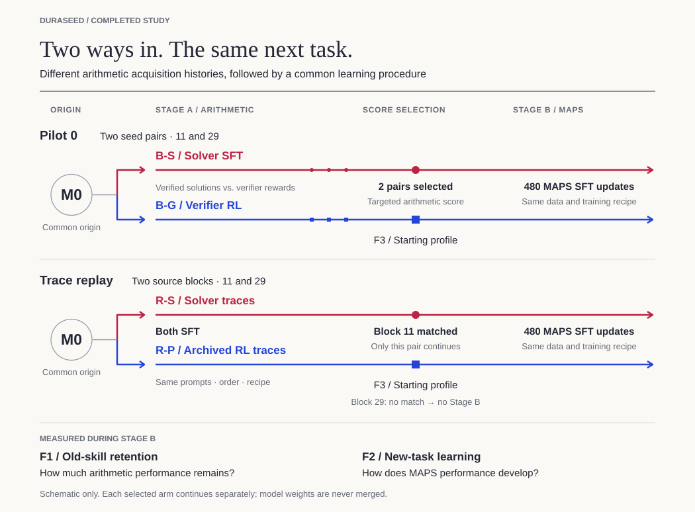
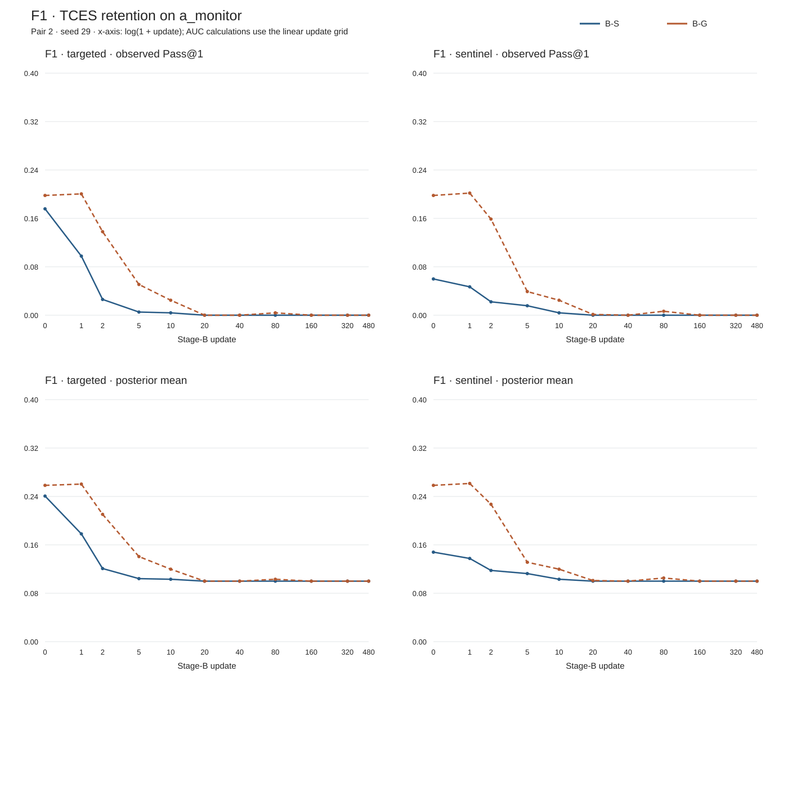
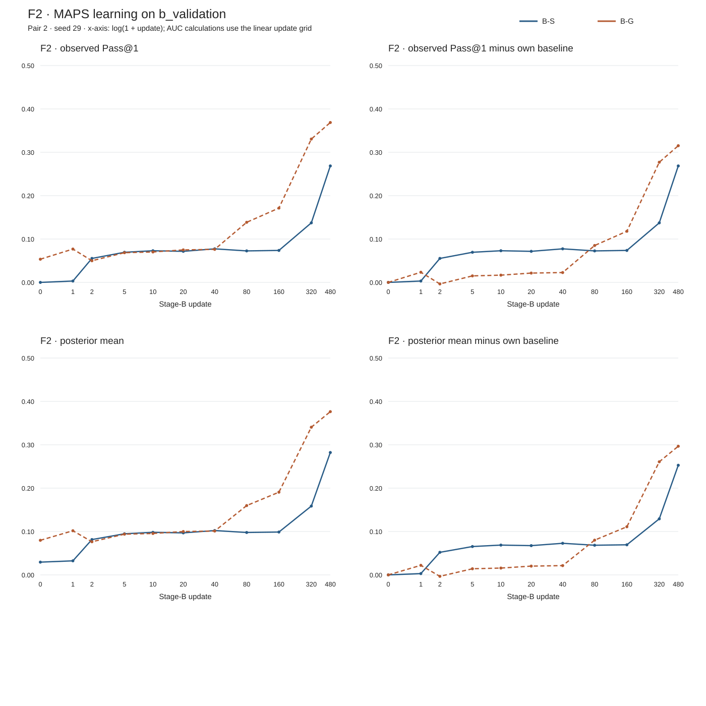

# DuraSeed

**Two models can have the same measured acquired capability and still become different learners.**

We trained the same base model to acquire the same arithmetic capability using
either supervised fine-tuning or on-policy reinforcement learning, selected
checkpoints with matched measured capability, and then gave both checkpoints
exactly the same subsequent training.

Across two independently matched pairs, the SFT-acquired checkpoint consistently:

- forgot the previously acquired capability faster; and
- learned the new downstream task faster early in training.

The RL-acquired checkpoint consistently:

- retained the previous capability longer;
- transferred more strongly to the new task before training; and
- finished the downstream training run with higher absolute performance.

For brevity, **B-S** is the SFT-acquired branch and **B-G** is the RL-acquired
branch.

After Pair 1, adapter geometry suggested a prospective prediction: the SFT
checkpoint's much larger inherited LoRA B-factor scale should identify the
checkpoint that both forgets faster and learns faster early. Before Pair-2
F1/F2/F3 outcomes were inspected, geometry again selected B-S. Both registered
Pair-2 predictions held:

- retention half-life: **B-S 1.136 updates vs B-G 3.343**; and
- early Stage-B gain AUC(0–40): **B-S 0.069696 vs B-G 0.018779**.

This is the first genuinely prospective result in the project, not another
post-hoc observation.

## The experiment

1. **Acquire a capability.** Starting from the same Qwen3.5-9B-Base checkpoint,
   B-S learns an exact-verifier arithmetic task from fixed verified
   derivations; B-G learns it through on-policy generation and verifier rewards.
2. **Match checkpoints.** Within each pair, a frozen rule selects real
   checkpoints with the same measured targeted score.
3. **Train both identically on a new task.** Both selected checkpoints keep
   their Stage-A LoRA adapters, receive fresh optimizers, and undergo the same
   480-update program-synthesis training.

We then measure:

- **F1 — retention:** how quickly the arithmetic capability is overwritten;
- **F2 — future learning:** how quickly and how far the new capability develops;
  and
- **F3 — starting profile:** transfer, generalization, response length,
  validity, diversity, and surprisal before the later training begins.

B-S and B-G are complete acquisition procedures, not a loss-function-only
comparison. All task answers are checked by deterministic verifiers; no judge
model is used.

## Pilot 0 results

All two-arm entries below are **B-S / B-G**. Pass@1 values and AUCs are
proportions.

| Metric | Pair 1 · seed 11 | Pair 2 · seed 29 |
|---|---:|---:|
| Selected checkpoints | B-S@140 / B-G@30 | B-S@40 / B-G@20 |
| Matched targeted score | 31/96 / 31/96 | 17/96 / 17/96 |
| F1 targeted half-life, updates | 2.664 / 4.105 | 1.136 / 3.343 |
| F2 baseline-relative gain AUC(0–40) | 0.076927 / 0.017735 | 0.069696 / 0.018779 |
| F2 starting raw Pass@1 | 0.000000 / 0.049927 | 0.000000 / 0.053467 |
| F2 endpoint raw Pass@1 | 0.378174 / 0.403687 | 0.268555 / 0.368652 |
| ‖B‖F ratio, B-S ÷ B-G | 7.36× | 5.46× |

F1 half-life is the first interpolated downward crossing of 50% of that arm's
own targeted update-0 raw Pass@1. F2 AUC(0–40) integrates baseline-relative raw
Pass@1 over the fixed early grid and divides by 40.

### F1 — retention of the acquired capability

| Pair 1 · seed 11 | Pair 2 · seed 29 |
|:---:|:---:|
|  |  |

### F2 — learning the new capability

| Pair 1 · seed 11 | Pair 2 · seed 29 |
|:---:|:---:|
|  |  |

The F2 figures show absolute Pass@1 and change from each branch's own update-0
baseline. The early comparison uses only the frozen 0–40 grid; endpoints are
reported separately.

## What replicated

- B-S showed faster F1 decay in both pairs.
- B-S had the larger early F2 gain AUC(0–40) in both pairs.
- B-G had higher zero-shot Stage-B transfer in both pairs.
- B-G had the higher Stage-B endpoint in both pairs.
- The broad behavioral fingerprint repeated: B-G had much greater sentinel
  transfer, longer outputs, higher surprisal, and many more verified strategy
  families.
- Pair-2 geometry prospectively predicted the F1/F2 ordering before its
  outcomes were opened.

## What did not replicate exactly

The 0–480 raw-gain AUC favored B-S in Pair 1 (**B-S 0.246866 vs B-G
0.189930**) and B-G in Pair 2 (**B-G 0.176493 vs B-S 0.119604**).

The early and late regimes differ: B-S consistently moved faster early, while
B-G consistently finished higher. An integral over the whole trajectory
therefore depends on when the curves cross.

## Why this matters

Current benchmark performance does not fully characterize a trained model. Two
checkpoints that score the same on the capability used for matching can differ
substantially in how they generalize, how quickly later training changes them,
and how quickly previously acquired behavior is overwritten.

This matters for sequential post-training and continual learning because
training history may determine not only what a model can do now, but how it
responds to the next update.

## Scientific conclusion

> Under this controlled acquisition and matching setup, SFT- and RL-acquired
> checkpoints with matched measured capability reproducibly exhibited
> different subsequent learning and forgetting dynamics.

Pilot 0 contains only two independently matched pairs, uses one model and one
rank-32 LoRA setup, and selected different matched capability levels in the two
pairs. The geometry association is predictive but not yet causal.

These results do not establish that RL universally improves retention, that
SFT universally improves plasticity, or that LoRA B-factor scale causes the
observed dynamics.

## Full evidence

- [Pair-1 readout](artifacts/pilot0-pair1-readout/README.md) — complete F1/F2
  trajectories, exact counts, and F3 profile
- [Pair-2 outcome report](artifacts/pilot0-pair2-readout/outcome-report.md) —
  prospective score and complete readout
- [Pair-2 F1/F2 readout](artifacts/pilot0-pair2-readout/README.md)
- [Pair-1 offline analysis](artifacts/pilot0-pair1-offline-analysis/README.md) —
  paired uncertainty, failure analysis, early-window retention, and geometry
- [Pair-2 offline analysis](artifacts/pilot0-pair2-offline-analysis/README.md)
- [Pair-1 geometry report](artifacts/pilot0-pair1-offline-analysis/geometry.md)
- [Pair-2 geometry report](artifacts/pilot0-pair2-offline-analysis/geometry.md)
- [Prospective Pair-2 prediction and scoring record](docs/results/pilot0-pair2-prediction.md)
- [Frozen scientific protocol](PROTOCOL.md)

Licensed under the [Apache License 2.0](LICENSE).

**Pilot 0 is complete and frozen. A separately preregistered gauge-rescaling
experiment is planned to test whether changing LoRA parameterization while
holding the checkpoint function fixed can causally alter these future-learning
dynamics. Its results are not included here.**
