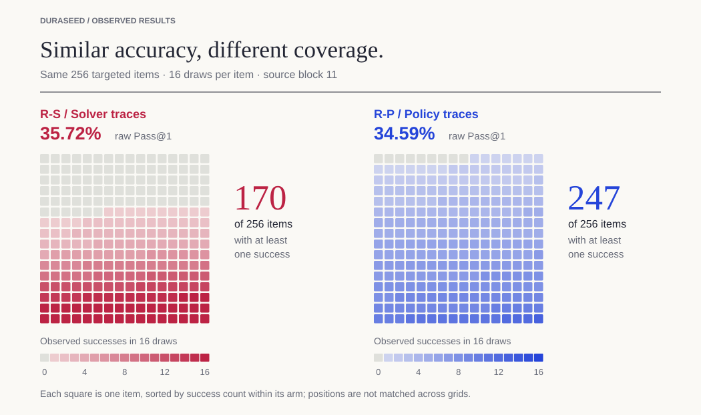
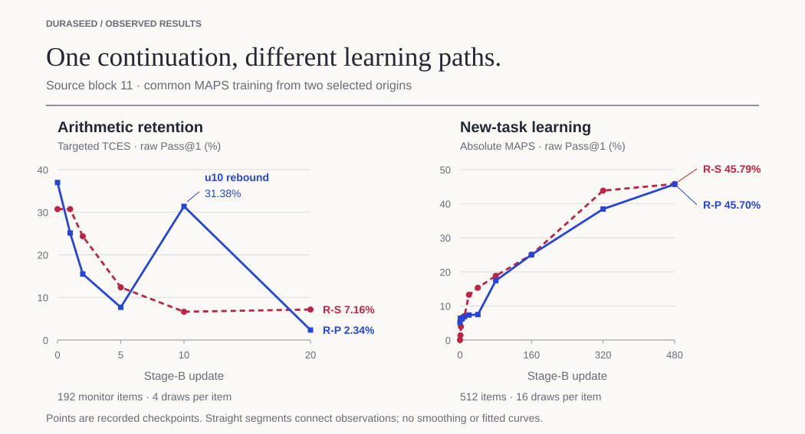

# DuraSeed

Two models reach similar arithmetic scores. Does that make them equally good
starting points for learning something new?

DuraSeed follows what happens next. We teach the models the same second task
and track how much arithmetic they retain, how quickly they learn, and what
their matching scores left out.

Supported by **$5,000 in compute credits from Thinking Machines Lab (TML)**
through its [Tinker Research Grant](https://thinkingmachines.ai/news/tinker-research-and-teaching-grants/).

**Pilot 0, trace replay, and the dense-retention follow-ups are complete.**
We are running one final comparison: can a student trained on a frozen RL
model's outputs inherit how that model learns next? The paper is being revised.

[The study](#the-study) · [Results](#results) · [Related work](#where-this-fits) ·
[Current experiment](#current-experiment-can-a-clone-inherit-a-learning-future) ·
[Data and reproduction](#data-and-reproduction)

The clearest example came from our trace-replay follow-up. Two saved versions
of the model—*checkpoints*—answered about 35% of arithmetic attempts correctly.
Give each 16 attempts
per problem, though, and one solved 170 of 256 problems while the other solved
247. One model repeatedly solved a smaller set of problems. The other spread
its successes across almost the whole set. During later training, the model
with broader coverage lost accuracy sharply, recovered much of it, then
declined again.

This repository contains the completed experiments, their results, and the
data needed to examine those differences, alongside the design of the final
comparison.

## The study

### Two tasks, with examples

**The old skill: arithmetic expressions.** Given some numbers and a target,
the model must build an expression using every number exactly once and only
the permitted operations. We call this task **TCES** (Template-Controlled
Expression Synthesis). Here is a small illustrative puzzle:

> Use **2, 3, 4, 5** exactly once to make **26**, using `+`, `−`, `×`, `÷`
> and parentheses. One answer is **(5 × 4) + (3 × 2) = 26**.

**The new task: short programs.** The model starts from a number and must
reach a target by choosing a sequence of allowed instructions. Arithmetic
is modular: after each instruction, keep the remainder on division by the
given modulus. This task is **MAPS** (Modular Affine Program Synthesis).
For example:

> Start at **8** and reach **5**, working modulo **17**, in at most two
> instructions. Allowed instructions: `ADD 2`, `ADD 3`, `ADD 7`, `MUL 2`,
> `MUL 3`, `NEG` (negate).
>
> One answer is **`ADD 3; MUL 2`**: first `8 + 3 = 11`, then `11 × 2 = 22`.
> The remainder of 22 divided by 17 is **5**, so the program reaches its target.

Both tasks involve arithmetic, but the required outputs are different:
an expression in TCES, an instruction sequence in MAPS. Exact, automatic
answer checkers verify the result and the rules, so we do not need a model
to judge another model's answers.

### How the comparisons work

Every branch starts from **M0**, our common Qwen3.5-9B-Base checkpoint,
prepared to follow the required answer format. We train rank-32 **LoRA
adapters**: small trainable additions to otherwise fixed model weights.
Each separately trained branch is an *arm* of the comparison.

We call arithmetic training **Stage A**. Once we have selected two
checkpoints with similar arithmetic scores, we train each on MAPS:
**Stage B**. Matching gives us a comparable starting accuracy on the old
task. Both checkpoints then receive the same 480-update recipe and data
order, with fresh optimizers and no further TCES practice. An
*update* is one training step; Stage-B update 0 is the point just before
training on the new task starts.

We first compared **supervised fine-tuning (SFT)**, which teaches the model
to reproduce supplied solutions, with **reinforcement learning (RL)**,
which lets it try its own solutions and learn from the answer checker's
rewards. This **Pilot 0** comparison produced two matched pairs, using
random seeds 11 and 29 to repeat the experiment.

We then asked how much of the difference could follow the worked solutions
themselves. A *trace* is the saved text of a solution. In **trace replay**,
both branches use SFT, but one learns from solver solutions and the other
from correct solutions saved during Pilot RL. No new RL is performed in
replay.

These are the short labels used in the figures and result files:

| Comparison | Label | How arithmetic is learned |
|---|---|---|
| Pilot 0 | **B-S — solver SFT** | Reproduce verified solutions written by an algorithmic solver. |
| Pilot 0 | **B-G — verifier RL** | Generate attempts and learn from correctness rewards. |
| Trace replay | **R-S — solver-trace SFT** | Learn from solver solutions on the shared replay prompts. |
| Trace replay | **R-P — policy-trace SFT** | Learn from correct solutions previously generated by the RL model. |

The measurements follow this sequence too. **F3, the starting profile,**
describes the selected checkpoints before Stage B begins. During Stage B,
**F1, retention,** tracks the old arithmetic skill, and **F2, new-task
learning,** tracks MAPS. A *panel* is a fixed set of evaluation problems.
Problem *families* share an arithmetic generation template. Targeted panels
test the families chosen for training; held-out panels test other families
excluded from that training.


Each generated answer is one *attempt* (also called a *draw*). Unless stated
otherwise, accuracy means the fraction of individual attempts that were correct,
including invalid outputs in the denominator. This is raw **Pass@1**.

## Results

### Pilot 0: matching the score leaves much unmatched

In the Pilot, **B-S** learned from solver-written arithmetic solutions through
SFT. **B-G** learned through RL, receiving rewards from the answer checker.
Within each pair, the selected checkpoints had identical scores on the
matching assessment.

In both pairs, B-G took longer to lose half its starting arithmetic accuracy.
It also had a head start on program synthesis: roughly 5% accuracy before
Stage B, while B-S started at zero. B-G finished higher in both pairs.

B-S nevertheless made the larger improvement from its own starting point
during the first 40 updates. This is why we report both scores and gains. A
branch can improve more while still solving fewer problems, because it began
further behind. Over the full training run, even the ordering of the gains
changed between pairs.

<details>
<summary>Pilot results for both pairs, including the prospective prediction</summary>

Values are **B-S / B-G**. A half-life is the first time arithmetic accuracy
falls to half its own starting score. Window means average the recorded
curve over the stated updates; gains subtract each branch's baseline.
“pp” means percentage points.

| Pilot result · B-S / B-G | Pair 1 · seed 11 | Pair 2 · seed 29 |
|---|---:|---:|
| Selected Stage-A updates | 140 / 30 | 40 / 20 |
| Matching score | 31/96 / 31/96 | 17/96 / 17/96 |
| Targeted arithmetic half-life, updates | 2.664 / 4.105 | 1.136 / 3.343 |
| New-task baseline | 0.00% / 4.99% | 0.00% / 5.35% |
| Mean new-task gain, updates 0–40 | 7.69 / 1.77 pp | 6.97 / 1.88 pp |
| Mean absolute new-task score, updates 0–40 | 7.69% / 6.77% | 6.97% / 7.22% |
| Mean new-task gain, updates 0–480 | 26.23 / 20.18 pp | 12.71 / 18.75 pp |
| New-task endpoint | 37.82% / 40.37% | 26.86% / 36.87% |

The saved adapters supplied a further prediction. LoRA represents each weight
update as a product of two matrices, B and A. The B-factor norm summarizes
the size of these B matrices. This B is unrelated to our Stage-B label. B-S's norm
was 7.36 times B-G's in Pair 1 and 5.46 times in Pair 2. Before inspecting
Pair-2 outcomes, we recorded that B-S would have the shorter targeted
half-life and the larger early baseline-relative gain. Both predictions held.
The [dated record](docs/results/pilot0-pair2-prediction.md) includes the
geometry measurements and the scoring rule.

</details>

### Trace replay: do the worked solutions carry the difference?

The Pilot changed two things together: the learning procedure and the
solutions the model encountered. We followed it with two SFT branches that
changed the solution source. **R-S** learned from solver-written solutions.
**R-P** learned from correct solutions archived from Pilot RL—the *policy
traces*. The prompts, their order, and the supervised recipe were shared.

We built a replay dataset from each Pilot seed pair, giving two *source
blocks*. One yielded a matched pair. Its checkpoints were
one correct attempt apart on the matching assessment: 1,504/4,096 for R-S
and 1,503/4,096 for R-P. Fresh evaluation gave 35.72% and 34.59% accuracy.
Looking at individual problems revealed how differently those similar
averages were composed.



Each bar counts problems with a particular number of correct attempts.
R-S's distribution has a large group at each extreme: it solved 35 problems
on all 16 attempts and never solved 86. R-P reached far more of the problem
set, solving 247 of 256 at least once. It had no perfect-16 problems, and
left only nine unsolved. Giving the model more chances therefore exposed a
large coverage gap that the single-attempt average had hidden.

The difference also extended to arithmetic families left out of acquisition.
On those held-out problem types, R-P scored **35.84%**, against **2.76%** for
R-S. R-P led on the held-out-family panel at every one of the 30 recorded
acquisition checkpoints in both source blocks. Broad coverage and this
generalization gap appeared even though both replay branches learned through
SFT.

The checkpoints differed in their responses too. R-P, the policy-trace SFT
model, gave much longer answers and produced more distinct verifier-derived
solution patterns. It
could already solve some program-synthesis problems, as B-G could in the
Pilot. These are the starting profiles, **F3**: a closer look at the models
we were about to train on the new task.

<details>
<summary>Full starting-profile comparison (F3)</summary>

`R-S @220` means the solver-trace model saved after 220 Stage-A updates;
`R-P @20` means the policy-trace model saved after 20. These become the
starting checkpoints for Stage B, whose update count begins again at zero.

| Selected replay checkpoint | Solver traces · R-S @220 | Policy traces · R-P @20 |
|---|---:|---:|
| Targeted arithmetic success per attempt | 35.72% | 34.59% |
| Targeted problems solved at least once / 256 | 170 | 247 |
| Held-out-family success per attempt | 2.76% | 35.84% |
| Median targeted response length, tokens | 84 | 628 |
| Distinct targeted strategy signatures | 52 | 512 |
| Mean targeted token surprisal, nats/token | 0.061 | 0.178 |
| New-task success before training | 0.00% | 5.19% |

These arithmetic profiles use 16 attempts per item. Strategy signatures count
verifier-derived structural patterns in correct solutions. Token surprisal
measures how unexpected the generated tokens were to the generating model.
The [full profiles](artifacts/replay-v1/followup/profiles/) include per-family
scores, output validity, length stops, and repetition.

</details>

### Following the skill through later training (F1 / F2)

Would R-P's broader arithmetic coverage make the skill last longer? The
retention curve gave a more complicated answer. While both branches learned
program synthesis, we repeatedly tested a separate set of 192 targeted
arithmetic problems. Four answers per problem at each evaluation gave
768 attempts to measure how much of the old skill remained.



R-P initially lost arithmetic accuracy faster. Its score fell to half its
starting value after 1.69 updates, compared with 4.25 for R-S. Then it
rebounded: between updates 5 and 10, correct attempts rose from 59 to 241
out of 768. That recovery was large enough to give R-P the higher average
arithmetic score over the first 20 updates—17.62%, compared with 11.49%.

Meanwhile, on the new task (**F2**), R-S made more progress from its starting
score during the first 40 updates and had the higher average score across
all 480 updates. By the end, the two were close: 45.79% for R-S and 45.70%
for R-P. Both had lost arithmetic performance on the final targeted and
held-out-family evaluations, where neither produced a correct attempt.

So the replay did not reproduce the Pilot's ordering of initial forgetting:
the policy-trace branch crossed half its starting score first. Yet its
rebound gave it the higher early-window average. A checkpoint's coverage,
its first drop in accuracy, and its performance over time each describe a
different part of what it learned. Here, choosing just one of them would
change the answer to which branch retained arithmetic better.

<details>
<summary>Replay trajectory summaries, uncertainty, and metric definitions</summary>

| Replay summary · source block 11 | R-S | R-P |
|---|---:|---:|
| Targeted arithmetic half-life, updates | 4.250 | 1.689 |
| Mean targeted arithmetic score, updates 0–20 | 11.49% | 17.62% |
| Mean new-task score, updates 0–40 | 11.02% | 7.07% |
| Mean new-task gain over own baseline, updates 0–40 | 11.02 pp | 1.88 pp |
| Mean new-task score, updates 0–480 | 32.41% | 29.77% |
| New-task endpoint, update 480 | 45.79% | 45.70% |

Paired item-bootstrap 95% intervals give a 6.13-point arithmetic
window-average advantage for R-P [4.29, 7.94] and a 2.65-point full-window
new-task advantage for R-S [1.88, 3.42]. The endpoint difference, R-P minus
R-S, is −0.09 points [−1.92, 1.76].
[Complete trajectories, counts, and intervals](artifacts/replay-v1/followup/readout.md).

A window average summarizes the score across a stretch of training. We
connect adjacent measurements with straight lines, calculate the area under
that curve, and divide by the number of updates in the window (the
trapezoidal AUC divided by window width). Gain subtracts the branch's own
update-0 score. “pp” means percentage points.

Half-life is the first downward crossing of half the branch's starting
arithmetic score, linearly interpolated between checkpoints. Retention follows
the checkpoint's total accuracy, including ability already present at the
common origin.

</details>

### Measuring the rebound and repeating acquisition

We re-evaluated the saved update-10 checkpoint: it again solved about 30% of
targeted arithmetic attempts. Then we repeated the continuation from the same
starting checkpoints, measuring arithmetic after **every update through 20**.
The recovery appeared across updates 9–11 before accuracy fell again at 12.
Its average advantage was much smaller on this dense grid.

A separate run repeated both acquisition procedures with a new training order
on the same replay corpus. It selected different starting checkpoints. Here
the policy-trace branch declined early without the original rebound.

| Replay continuation | Selected R-S / R-P updates | Half-life, R-S / R-P | Mean targeted score, R-S / R-P, updates 0–20 |
|---|---:|---:|---:|
| Original, coarse grid | 220 / 20 | 4.25 / 1.69 | 11.49% / 17.62% |
| Same origins, dense grid | 220 / 20 | 3.82 / 1.55 | 11.10% / 11.66% |
| New acquisition order | 200 / 140 | 4.34 / 0.88 | 14.99% / 2.60% |

The policy-trace branch crossed half its initial score earlier in all three
continuations. Average retention depended on the trajectory and measurement
grid. The [dense readout](artifacts/replay-v1/dense-retention-20260909/README.md)
and [training-order readout](artifacts/replay-v1/order-seed47-20260909/readout.md)
give the full curves and paired item-level intervals. These runs use one
replay corpus; the dense run also reuses the original starting checkpoints.

## Current experiment: can a clone inherit a learning future?

The replay copied correct solutions collected throughout RL training. Our
final comparison asks a different question: **if we copy one finished model's
behavior, will the copy respond similarly to further training?**

We will train one RL teacher, freeze it, and teach an SFT student from all of
its sampled answers on fresh arithmetic problems—including wrong answers.
The student must match the teacher's accuracy, coverage, response length,
validity, and solution-pattern diversity, then pass confirmation on separate
problems. New-task performance is measured afterward, not used to choose the
student.

If that behavioral match succeeds, both checkpoints receive the same MAPS
training. We repeat each continuation twice through update 20 and follow one
teacher–student pair through update 480. Dense measurements let us ask whether
replacing the checkpoint changes its trajectory more than rerunning either
checkpoint does.

**Status: running—RL teacher acquisition began on September 10. No results yet.** The
[experiment specification](docs/experiments/endpoint-clone.md) fixes the
comparison and stopping rules. If no student passes the behavioral match,
the experiment ends there.

## Scope and limitations

The completed results cover one model and adapter rank, two Pilot pairs,
two matched replay acquisition pairs, and a dense continuation repeat from
one of those pairs. Pilot compares two complete acquisition
procedures. Replay changes several properties of the training solutions
together, including content, length, format, and strategy. Training-token doses
and selected acquisition durations differ. The adapter-scale observation remains
correlational. Our confidence intervals describe paired item resampling within
the observed runs, with training-seed and checkpoint-selection uncertainty
outside their scope. All reported panels are validation panels. The sealed
tests remain unopened.

The original replay matching design also required agreement with historical
Pilot-0 scores. We removed that requirement after seeing the candidate scores,
before any replay Stage-B outcomes. Block 11 then matched. Block 29 still
had no match and received no Stage-B training. The
[matching record](artifacts/replay-v1/followup/selection.json) contains both
decisions.

## Where this fits

[SFT Memorizes, RL Generalizes](https://proceedings.mlr.press/v267/chu25c.html)
examines generalization after acquisition.
[RL's Razor](https://arxiv.org/abs/2509.04259) and
[Retaining by Doing](https://arxiv.org/abs/2510.18874) examine preservation of
pre-existing abilities while a model learns through SFT or RL.
[Good SFT Optimizes for SFT, Better SFT Prepares for Reinforcement Learning](https://arxiv.org/abs/2602.01058)
studies how an SFT checkpoint prepares a model for later RL.

DuraSeed connects these questions by following an acquired skill into a
common later supervised-training stage. We measure its retention alongside
learning of the next task, with a detailed profile of each starting
checkpoint. The replay comparison then asks what follows the training
solutions when the acquisition procedure is held to SFT. That connection
between acquisition, the resulting skill profile, and subsequent learning
is the focus of this project.

## Data and reproduction

| Material | Contents |
|---|---|
| [Pilot-0 raw data](https://github.com/ely2ba/duraseed/releases/tag/pilot0-data-v1) | 519,424 completions, verifier rewards, prompts, token records, evaluations, and matching selections. [Data guide](docs/pilot0-data.md). |
| [Pilot audit and notebook](artifacts/replay-v1/pilot-audit/) | Raw and baseline-relative curves, paired uncertainty, item counts, and failure breakdowns for both pairs. |
| [Pair 1](artifacts/pilot0-pair1-readout/README.md) / [Pair 2](artifacts/pilot0-pair2-readout/README.md) | Original F1/F2 readouts, with profiles and geometry in the [Pair-1](artifacts/pilot0-pair1-offline-analysis/README.md) and [Pair-2](artifacts/pilot0-pair2-offline-analysis/README.md) analysis packages. |
| [Replay package](artifacts/replay-v1/followup/README.md) | Acquisition histories, matching decisions, per-item counts, F3 profiles, later-training curves, and corpus lineage. |
| [Dense retention](artifacts/replay-v1/dense-retention-20260909/README.md) / [new acquisition order](artifacts/replay-v1/order-seed47-20260909/readout.md) | Every-update arithmetic monitoring and the completed additional acquisition-order comparison. |
| [Checkpoint re-evaluation and offline analyses](artifacts/replay-v1/publication-checks-20260909/COMPUTATIONAL-HANDOFF.md) | Update-10 recheck, half-life intervals, and replay adapter geometry. |
| [Technical detail](docs/TECHNICAL.md) | Protocols, metric definitions, implementation, and procedural history. |

The replay release contains compact outcome records for count-based analysis.
Raw replay generation text and adapter tensors remain local, along with private
account metadata. The paper will be shared once revisions are complete.

The README result graphics can be regenerated from the included counts using
Python's standard library:

```sh
python tools/make_readme_figures.py
```

## Acknowledgements

This project was made possible by a
[Tinker Research Grant from Thinking Machines Lab](https://thinkingmachines.ai/news/tinker-research-and-teaching-grants/),
which provided the compute credits used to run the experiments.

## AI-assisted development

I developed DuraSeed as an independent research project, from framing the core
question and hypotheses through experimental design, implementation decisions,
debugging, analysis, and interpretation. I made the scientific and engineering
decisions throughout, including how to structure the comparisons, what to
measure, how to respond to failures, and what conclusions the evidence could
support.

I used OpenAI Codex as a coding partner, particularly for
implementation, boilerplate, scaffolding, tests, repetitive analysis, and
debugging. That leverage made it possible to execute a project of this scope
independently in weeks rather than months.

Coding agents also tend to produce more machinery than an experiment needs, so
part of the work was actively reviewing, simplifying, and redirecting the
implementation to keep the software serving the science rather than the other
way around.

Licensed under the [Apache License 2.0](LICENSE).
