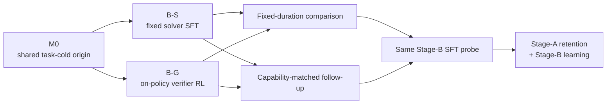

# DuraSeed

A model can reach the same score in more than one way. That does not necessarily
mean the different training methods leave it in the same condition.

One method might produce a skill that survives later training better. Another
might leave the model more ready to learn what comes next. If we only look at
the score immediately after training, we cannot see either difference.

DuraSeed asks a simple question:

> When two post-training methods teach the same model the same new skill to a
> comparable level, do they differ in how well that skill lasts and how easily
> the model learns the next skill?

This matters because useful models are rarely trained once and left alone.
They are fine-tuned, updated, and adapted again. A method that looks best on
today's benchmark may be a worse foundation for tomorrow's training if it
causes more forgetting or makes the next task harder to learn.

The study is deliberately narrow: one base model, rank-32 LoRA adapters, and
two synthetic task families with exact answers. This lets us measure the
trade-off without relying on a judge model or debating whether an answer was
mostly right. The goal is not to declare one training method universally
better. It is to find out whether the path used to acquire a skill can change
what happens when the model is trained again.

> **Research support:** This project was made possible in part by a generous
> **$5,000 research grant from [Thinking Machines Lab](https://thinkingmachines.ai/)**.

## Study at a glance



- **Shared:** M0, model, LoRA rank, panels, renderer, output cap, and
  Stage-B recipe.
- **Different:** the complete B-S and B-G acquisition procedures.
- **Measured afterward:** retention, future learning, behavior profiles,
  tokens, and cost.

## The experiment

### Stage A: two acquisition paths

Every run begins from the same format-capable `Qwen/Qwen3.5-9B-Base`
checkpoint, called M0. The first comparison then splits directly into two
paths:

- **B-S** uses supervised fine-tuning on a fixed set of correct,
  solver-generated answers.
- **B-G** learns from its own sampled attempts, scored by an exact verifier,
  using group-relative reinforcement learning.

In plain terms, this compares learning from a fixed book of worked solutions
with learning by trying solutions and receiving exact feedback. It is a
comparison between two complete acquisition procedures, not a claim that only
their loss functions differ. The procedures also differ in where their answers
come from, which answers the model sees, and how much generation and training
work they require. If they produce different later behavior, the first result
will therefore be about those complete procedures—not a universal claim that
"RL representations" are better or worse than "SFT representations."

Stage A uses arithmetic-expression problems. The model must combine a given
set of numbers, use each exactly once, and reach a target value. We look for
strategy families near the model's current ability boundary: hard enough to
leave room for learning, but not so hard that every answer is wrong.

Those families are divided into two closely matched 12-family panels. One is
trained while the other is held out as a sentinel, and their roles reverse
across paired seeds. This helps distinguish retention of the taught skill from
broader changes that affect everything.

### Stage B: one common downstream probe

After Stage A, every checkpoint receives the same Stage-B supervised training
on a separate modular program-synthesis task. Stage B continues the learned
Stage-A LoRA weights with a fresh optimizer; it does not attach a new adapter.
We measure two things together:

1. how much of the Stage-A skill remains as Stage B progresses; and
2. how quickly the model learns Stage B under the same training recipe.

### Scientific positioning

Recent work asks several nearby questions. [SFT Memorizes, RL
Generalizes](https://arxiv.org/abs/2501.17161) compares how behavior acquired
through SFT and RL generalizes to unseen variants. [RL's
Razor](https://arxiv.org/abs/2509.04259) and [Retaining by
Doing](https://arxiv.org/abs/2510.18874) study how well a model's pre-existing
abilities survive while it learns a new task, while [continual post-training
work](https://arxiv.org/abs/2507.05386) follows learned tasks through a longer
sequence. Other results show that a checkpoint's current score need not predict
how well it responds to [the training that comes
next](https://arxiv.org/abs/2602.01058). To our knowledge, the less-studied
combination is the one DuraSeed targets: checkpoints produced by two complete
acquisition procedures, compared at similar Stage-A capability, then exposed
to exactly the same, separate Stage-B training while we measure both retention
of Stage A and learning of Stage B. This is the distinction—not a claim that
sequential forgetting or model plasticity has gone unstudied.

### Analysis and reporting

Pilot 0 first compares B-S and B-G after the same fixed Stage-A duration. A
required follow-up then selects real checkpoints at comparable Stage-A
capability and repeats the common Stage-B probe. More precisely, those
checkpoints are matched on targeted-panel exact-success. We do not pretend that
one number makes their behavior identical. Before Stage B, we will also show
their target, sentinel, and family-by-family accuracy; how broadly success is
spread rather than concentrated in a few families; invalid-output rate;
completion length; Pass@k at supported sample counts; verified strategy
diversity; and sampled-token surprisal. These measurements reveal what remains
different without matching away differences that may be part of the phenomenon.

We will also show how Stage-A capability changes with cumulative acquisition
tokens and cost. Prompt/prefill, sampled, and training tokens remain separate
in the resource accounting: one dollar total is useful, but it should not hide
the very different work performed by the two procedures.

## Design safeguards

- **Exact tasks keep the measurement honest.** The generators, solvers, and
  verifiers are deterministic, so correctness does not depend on subjective
  grading.
- **One common origin keeps the comparison interpretable.** The model, adapter
  rank, initial checkpoint, panels, and Stage-B recipe are shared across paths.
- **Crossed panels control for family quirks.** Target and sentinel roles swap
  across paired seeds instead of relying on one lucky task split.
- **The separation rule matters more than the number 12.** Two matched
  12-family panels remain the preferred design. But 12 is not worth preserving
  by weakening data separation or looking at method results. If that size is
  genuinely infeasible, any different equal panel size must be chosen
  prospectively from feasibility and power alone, before Stage A begins.
- **Final tests stay sealed.** Training, calibration, checkpoint selection, and
  method decisions use separate data.
- **Independent runs come before a scale sweep.** For the first study, learning
  the seed-to-seed variance is more valuable than spreading the budget across
  several model sizes or adapter ranks. If the core effect holds up, a
  same-model higher-rank or full-weight replication is the most direct way to
  test whether it depends on the constrained LoRA update space, if the platform
  and budget allow it. A larger-model replication comes later.
- **Method breadth is earned by the result.** B-S versus B-G comes first. B-O
  remains a conditional mechanism pilot and G-U remains an optional prompt-
  allocation control. The old G-B arm is now identical to B-G and the old R-G
  teacher-allocation contrast no longer exists, so both are retired. If B-S
  and B-G separate reproducibly, the first mechanism test will be a supervised
  replay of a frozen, verifier-correct subset of B-G-generated answers. That
  attacks the data-versus-objective ambiguity more directly than immediately
  adding a wide collection of methods.

Here, "future learnability" has a specific meaning: learning under this fixed
supervised Stage-B probe. It is not presented as a universal measure of model
plasticity.

---

## Current status

### Done

- The clean repository reproduces the preserved task, verifier, and analysis
  implementation with zero scientific divergences.
- The remote engineering smoke passed training, sampling, reward parity, stop
  behavior, resume, and weights-only branching end to end.
- Two disjoint 12-family panels and a separate 12-family intermediate pool are
  frozen and authenticated.
- The unstable task-specific teacher warm start was retired after three bounded
  attempts.
- The six-arm direct-M0 learning-rate screen completed. Its recorded
  `no_eligible_learning_rate` decision was invalidated by a task/gate contract
  mismatch; the underlying generations, rewards, and training records remain
  preserved.

### Now

The corrected screen reduction has frozen `1e-4` for B-S and `1e-5` for B-G.
Exactly one two-arm run will now recreate those branches continuously from M0
through update 50. If either arm fails the corrected final gate, the TCES route
ends rather than opening another calibration ladder.

### Not started

Pilot 0 has not begun, no B-S/B-G comparison result exists, and final tests
remain sealed.

### Why the origin changed

The original panel rule failed because exact algebraic duplicates consumed
single-family test capacity. An outcome-blind amendment collapsed 49 eligible
families into 37 exact algebraic classes before matching. All 37 representatives
passed the unchanged capacity audit, and the archived and current split builders
then produced byte-identical train and gate manifests. The panel amendment is
documented separately in the repository's decision records.

The proposed shared task-specific teacher warm start then failed three bounded
feasibility attempts in different ways: learned nontermination, formatted but
reward-sparse checkpoints, and a final dose-8 checkpoint whose format gate
became mathematically unreachable. The attempts stopped without opening Pilot
outcomes or extending the ladder indefinitely. They are feasibility evidence,
not results about B-S, B-G, or the DuraSeed hypothesis.

B-S and B-G now branch weights-only, with fresh optimizers, directly from the
same M0. M0 is task-cold for TCES but is not an untouched pretrained model: it
already received the shared task-agnostic format training. This makes the
acquisition origin literal while preserving the complete-procedures framing.
The decision is recorded in the
[direct-M0 amendment](docs/rfc-direct-m0-stage-a-origin.md).

Frozen boundary evidence supports trying B-G from M0: predicted informative
group-size-8 probability across the 24 panel families ranges from 0.581 to
0.883, with median 0.739 and no family below 0.50. Because those are predictions,
the live calibration still requires realized rollout health through both the
10-update screen and the selected 50-update duration. It does not authorize a
new warm-start ladder if that bounded calibration fails.

The direct-M0 screen then exposed a measurement error rather than an absence of
usable learning rates. The TCES prompt requests a concise derivation before one
final answer tag, the B-S teacher supplies exactly that form, and the verifier
allows derivation outside the tag. The screen's old format reducer nevertheless
required the whole completion to begin with `<answer>`, making every
teacher-style B-S answer fail by construction. The raw terminal record is kept,
but its `no_eligible_learning_rate` decision is not scientifically valid.

The [answer-tag contract correction](docs/rfc-stage-a-answer-tag-contract.md)
replaces that metric with verifier-valid tag retention: on the targeted panel,
the trained arm must remain within 0.10 of its paired M0 valid-tag rate. Invalid
and length-stopped
outputs still score zero and remain reported outcomes. No prompt, teacher,
verifier, decoder, task, panel, or learning-rate grid changed.

### Next milestones

1. Run the single selected B-S/B-G M0-to-update-50 finalization. If either arm
   fails, stop the TCES acquisition route.
2. Run the two-seed B-S/B-G Pilot 0 at fixed duration, then run the required
   capability-matched follow-up and publish the complete pre-Stage-B profile.
3. Extend to three or four paired seeds to estimate variance. Only then decide
   whether supervised replay, conditional B-O, or optional G-U is warranted.
4. Freeze and preregister the confirmatory design, run it on fresh seeds, and
   reserve higher-rank or full-weight replication for an effect worth pursuing.

Pilot 0 has not started, no sealed test data has been opened, and no result is
claimed for the stability–future-learnability question. Everything completed so
far is calibration, feasibility evidence, and experiment preparation.

---

## Repository layout

Start with [`docs/MAP.md`](docs/MAP.md) for the component map, scientific data flow, and provenance locations. Current gate status is tracked in [`docs/STATUS.md`](docs/STATUS.md).

- `src/duraseed/tasks/`: TCES and MAPS generators, parsers, solvers, and exact verifiers.
- `src/duraseed/data/`: split, manifest, leakage, boundary, panel, and matching logic.
- `src/duraseed/training/`: verified-data builders and calibration decision reducers.
- `src/duraseed/evaluation/`: item-level transition and frontier analysis.
- `src/duraseed/runtime/`: bounded Tinker client, sampling, checkpoint, ledger, and billing code.
- `src/duraseed/runners/`: orchestration for the next authorized experimental gates.
- `frozen/v0/` and `provenance/`: preserved calibration evidence, hashes, and replay records.
- `PROTOCOL.md`: public scientific contract and calibration record.

## Local checks

Python 3.11 or 3.12 and [`uv`](https://docs.astral.sh/uv/) are required.

```bash
uv sync --extra dev
python tools/check_size.py
uv run pytest
uv run ruff check src tests
uv run ruff format --check src tests
uv lock --check
uv run duraseed validate
```

These checks are local and credential-free. Remote Tinker access requires a separate, explicit launch authorization and spend cap.

## Research scope

The design compares acquisition paths under one base model, one adapter rank, synthetic exact tasks, and one frozen supervised Stage-B probe. Any eventual inference is conditional on those choices. Calibration outcomes and engineering checks are not results for the stability–plasticity hypothesis.

## Development note

This is both a research project and a learning experience for me. I use Codex
for much of the implementation work. Agent-assisted development—at least in
its 2026 form—can make a project like this possible for one person, but it can
also create code bloat and more scaffolding than a compact hand-written project
would need. I have made a deliberate effort to keep that under control by
narrowing the experimental design, removing obsolete paths, and keeping only
the machinery needed to make the science executable and auditable.

Constructive input is welcome, whether it concerns the scientific design,
statistics, implementation, or unnecessary complexity. Please feel free to
[open an issue](https://github.com/ely2ba/duraseed/issues) with criticism,
questions, or suggestions.

## License

[Apache License 2.0](LICENSE)
