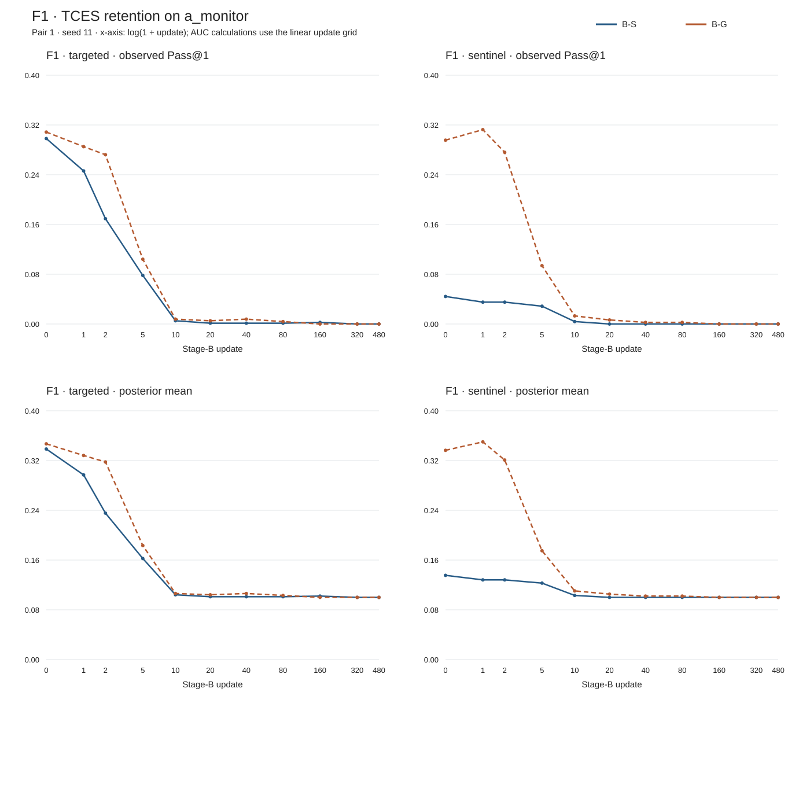
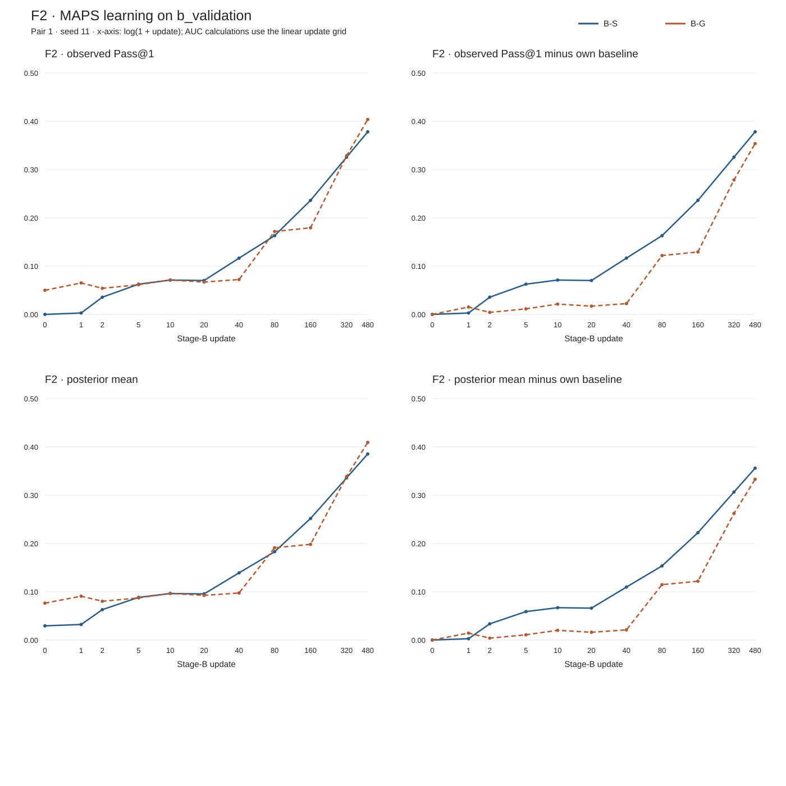

# Pair-1 scientific readout

Run: `pilot0-pair1-seed11-20260825T125100Z`. Seed: 11. Local artifacts only.

Matching selected B-S Stage-A update 140 and B-G update 30; each had 31/96 targeted exact successes on the cadence matching panel. Both Stage-B schedules ran 480 updates.

Raw source references ([data download and layout](../../docs/pilot0-data.md)): terminal result (`runs/pilot0/pilot0-pair1-seed11-20260825T125100Z/result.json`), matching record (`runs/pilot0/pilot0-pair1-seed11-20260825T125100Z/seed-11/matching.json`), [exact readout data](readout.json), [both F3 profiles](F3.md).

All sequences below follow this Stage-B update grid:

`[0, 1, 2, 5, 10, 20, 40, 80, 160, 320, 480]`

Rates are proportions, not percentages. Printed sequences use six decimal places; readout.json retains the stored precision, exact success/trial counts, and every source path. Pass@k uses the stored unbiased item-averaged estimator. Posterior means use the item-level Jeffreys estimator `(successes + 0.5)/(draws + 1)`, averaged equally over items.

The zero-success posterior floor is 0.1 with four draws and 0.029411764705882353 with 16 draws; it is not observed Pass@1. a_monitor has 192 targeted and 192 sentinel items × 4 draws; a_validation has 256 targeted and 256 sentinel items × 16 draws; b_validation has 512 MAPS items × 16 draws.

## F1 · retention trajectories

### B-S

Targeted a_monitor:

- Exact successes/trials: `[229/768, 189/768, 130/768, 60/768, 4/768, 1/768, 1/768, 1/768, 2/768, 0/768, 0/768]`.
- Pass@1: `[0.298177, 0.246094, 0.169271, 0.078125, 0.005208, 0.001302, 0.001302, 0.001302, 0.002604, 0.000000, 0.000000]`.
- Pass@4: `[0.635417, 0.625000, 0.500000, 0.213542, 0.020833, 0.005208, 0.005208, 0.005208, 0.010417, 0.000000, 0.000000]`.
- Posterior mean: `[0.338542, 0.296875, 0.235417, 0.162500, 0.104167, 0.101042, 0.101042, 0.101042, 0.102083, 0.100000, 0.100000]`.
- Posterior absolute AUC: `0.10255750868055556`.

Targeted a_validation, selected checkpoint → Stage-B update 480:

- Exact successes/trials: 1377/4096 → 0/4096.
- Posterior mean: `0.34581801470588236` → `0.029411764705882353`; change `-0.31640625`.
- Pass@1: `0.336181640625` → `0.0`.
- Pass@4: `0.7142127403846154` → `0.0`.
- Pass@16: `0.92578125` → `0.0`.

Sentinel a_monitor:

- Exact successes/trials: `[34/768, 27/768, 27/768, 22/768, 3/768, 0/768, 0/768, 0/768, 0/768, 0/768, 0/768]`.
- Pass@1: `[0.044271, 0.035156, 0.035156, 0.028646, 0.003906, 0.000000, 0.000000, 0.000000, 0.000000, 0.000000, 0.000000]`.
- Pass@4: `[0.104167, 0.098958, 0.114583, 0.114583, 0.015625, 0.000000, 0.000000, 0.000000, 0.000000, 0.000000, 0.000000]`.
- Posterior mean: `[0.135417, 0.128125, 0.128125, 0.122917, 0.103125, 0.100000, 0.100000, 0.100000, 0.100000, 0.100000, 0.100000]`.
- Posterior absolute AUC: `0.10045247395833336`.

Sentinel a_validation, selected checkpoint → Stage-B update 480:

- Exact successes/trials: 171/4096 → 0/4096.
- Posterior mean: `0.06870404411764706` → `0.029411764705882353`; change `-0.03929227941176471`.
- Pass@1: `0.041748046875` → `0.0`.
- Pass@4: `0.11793440934065934` → `0.0`.
- Pass@16: `0.2421875` → `0.0`.

### B-G

Targeted a_monitor:

- Exact successes/trials: `[237/768, 219/768, 209/768, 80/768, 6/768, 4/768, 6/768, 3/768, 0/768, 0/768, 0/768]`.
- Pass@1: `[0.308594, 0.285156, 0.272135, 0.104167, 0.007812, 0.005208, 0.007812, 0.003906, 0.000000, 0.000000, 0.000000]`.
- Pass@4: `[0.682292, 0.687500, 0.625000, 0.343750, 0.031250, 0.020833, 0.031250, 0.015625, 0.000000, 0.000000, 0.000000]`.
- Posterior mean: `[0.346875, 0.328125, 0.317708, 0.183333, 0.106250, 0.104167, 0.106250, 0.103125, 0.100000, 0.100000, 0.100000]`.
- Posterior absolute AUC: `0.10334309895833335`.

Targeted a_validation, selected checkpoint → Stage-B update 480:

- Exact successes/trials: 1269/4096 → 0/4096.
- Posterior mean: `0.3210018382352941` → `0.029411764705882353`; change `-0.29159007352941174`.
- Pass@1: `0.309814453125` → `0.0`.
- Pass@4: `0.7290049793956044` → `0.0`.
- Pass@16: `0.984375` → `0.0`.

Sentinel a_monitor:

- Exact successes/trials: `[227/768, 240/768, 212/768, 72/768, 10/768, 5/768, 2/768, 2/768, 0/768, 0/768, 0/768]`.
- Pass@1: `[0.295573, 0.312500, 0.276042, 0.093750, 0.013021, 0.006510, 0.002604, 0.002604, 0.000000, 0.000000, 0.000000]`.
- Pass@4: `[0.718750, 0.755208, 0.697917, 0.312500, 0.052083, 0.026042, 0.010417, 0.010417, 0.000000, 0.000000, 0.000000]`.
- Posterior mean: `[0.336458, 0.350000, 0.320833, 0.175000, 0.110417, 0.105208, 0.102083, 0.102083, 0.100000, 0.100000, 0.100000]`.
- Posterior absolute AUC: `0.10302842881944446`.

Sentinel a_validation, selected checkpoint → Stage-B update 480:

- Exact successes/trials: 1296/4096 → 0/4096.
- Posterior mean: `0.3272058823529412` → `0.029411764705882353`; change `-0.2977941176470588`.
- Pass@1: `0.31640625` → `0.0`.
- Pass@4: `0.7300008585164836` → `0.0`.
- Pass@16: `0.953125` → `0.0`.

## F2 · learning curves

Baseline-relative means subtract the same arm's update-0 score. The headroom-normalized series divides that difference by `1 - baseline + 1e-12`. AUC uses trapezoidal integration on the linear update grid, divided by 480; raw-gain AUC is absolute AUC minus the update-0 posterior mean. The figures use a transformed x-axis only for display.

### B-S

- Exact successes/trials: `[0/8192, 24/8192, 292/8192, 513/8192, 583/8192, 575/8192, 955/8192, 1336/8192, 1935/8192, 2668/8192, 3098/8192]`.
- Absolute Pass@1: `[0.000000, 0.002930, 0.035645, 0.062622, 0.071167, 0.070190, 0.116577, 0.163086, 0.236206, 0.325684, 0.378174]`.
- Absolute Pass@4: `[0.000000, 0.011523, 0.125390, 0.214822, 0.243183, 0.237036, 0.333665, 0.377544, 0.431811, 0.524513, 0.603617]`.
- Absolute Pass@16: `[0.000000, 0.042969, 0.328125, 0.531250, 0.623047, 0.564453, 0.636719, 0.656250, 0.697266, 0.771484, 0.792969]`.
- Pass@1 minus own baseline: `[0.000000, 0.002930, 0.035645, 0.062622, 0.071167, 0.070190, 0.116577, 0.163086, 0.236206, 0.325684, 0.378174]`.
- Absolute posterior mean: `[0.029412, 0.032169, 0.062960, 0.088350, 0.096392, 0.095473, 0.139131, 0.182904, 0.251723, 0.335938, 0.385340]`.
- Posterior mean minus own baseline: `[0.000000, 0.002757, 0.033548, 0.058938, 0.066981, 0.066062, 0.109720, 0.153493, 0.222312, 0.306526, 0.355928]`.
- Headroom-normalized posterior relative series: `[0.000000, 0.002841, 0.034564, 0.060724, 0.069010, 0.068063, 0.113045, 0.158144, 0.229048, 0.315814, 0.366714]`.

- `absolute_auc`: `0.2762780283011642`.
- `final_score`: `0.38534007352941174`.
- `headroom_normalized_gain_auc`: `0.2543470594615435`.
- `initial_score`: `0.029411764705882353`.
- `raw_gain_auc`: `0.24686626359528185`.

### B-G

- Exact successes/trials: `[409/8192, 534/8192, 443/8192, 503/8192, 584/8192, 549/8192, 592/8192, 1407/8192, 1469/8192, 2691/8192, 3307/8192]`.
- Absolute Pass@1: `[0.049927, 0.065186, 0.054077, 0.061401, 0.071289, 0.067017, 0.072266, 0.171753, 0.179321, 0.328491, 0.403687]`.
- Absolute Pass@4: `[0.170956, 0.217866, 0.172853, 0.207491, 0.240945, 0.233288, 0.245956, 0.361291, 0.403354, 0.526066, 0.600991]`.
- Absolute Pass@16: `[0.435547, 0.519531, 0.404297, 0.486328, 0.576172, 0.587891, 0.587891, 0.597656, 0.726562, 0.771484, 0.781250]`.
- Pass@1 minus own baseline: `[0.000000, 0.015259, 0.004150, 0.011475, 0.021362, 0.017090, 0.022339, 0.121826, 0.129395, 0.278564, 0.353760]`.
- Absolute posterior mean: `[0.076402, 0.090763, 0.080308, 0.087201, 0.096507, 0.092486, 0.097426, 0.191062, 0.198185, 0.338580, 0.409352]`.
- Posterior mean minus own baseline: `[0.000000, 0.014361, 0.003906, 0.010800, 0.020106, 0.016085, 0.021025, 0.114660, 0.121783, 0.262178, 0.332950]`.
- Headroom-normalized posterior relative series: `[0.000000, 0.015549, 0.004229, 0.011693, 0.021769, 0.017415, 0.022764, 0.124145, 0.131857, 0.283866, 0.360493]`.

- `absolute_auc`: `0.2663314520143995`.
- `final_score`: `0.40935202205882354`.
- `headroom_normalized_gain_auc`: `0.20564111933468632`.
- `initial_score`: `0.0764016544117647`.
- `raw_gain_auc`: `0.1899297976026348`.

## Stored paired contrast · B-S minus B-G

- F2 raw-gain Stage-B AUC difference: `0.05693646599264707`.
- F1 update-480 targeted posterior retention difference: `0.0`.

## F3 · pre-Stage-B profiles

[Both profiles, including panel metrics and full-source links](F3.md). The MAPS update-0 values above are the baseline Stage-B task performance before Stage-B training.

## Local checks

Both F1/F2 cells reproduced exactly from the saved evaluation item counts using the existing reducer. Both stored F2 AUCs reproduced from the 11-point linear grid. No new sampling, training, or remote calls were used for this readout.
