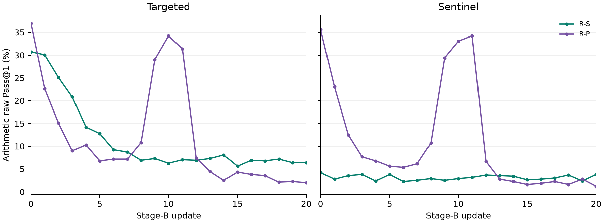

# Dense arithmetic-retention replication

Separate dense-grid replication of the two replay arms from seed 11. No original frozen observation, primary result, or uncertainty estimate is replaced. Arithmetic monitoring only; no new MAPS outcome is computed.

Update 0 reuses each arm's original pre-B a_monitor observation (192 targeted and 192 sentinel items, four draws each). Updates 1–20 are new training/evaluation observations from the saved selected origins.

Raw Pass@1 includes every sampled completion. Retention AUC is trapezoidally integrated over updates 0–20 and divided by 20, without baseline subtraction. Half-life is the first downward crossing of half of each arm's own update-0 raw Pass@1, linearly interpolated between adjacent updates.

50,000 NumPy PCG64 paired whole-item trajectory percentile replicates per contrast, namespace dense-retention-20260909|. Both arms and all checkpoints use identical resampled item indices; each item's four realized draws stay together. Items are treated as independent exchangeable clusters, without family clustering. Intervals do not quantify training-seed variation, selection uncertainty, or unsampled within-update behavior. No half-life replicate is discarded; intervals are withheld if any are undefined or censored.

## Dense-grid summaries

All intervals are paired item-bootstrap 95% intervals, conditional on this training realization.

| Role | Arm / contrast | 0–20 raw retention AUC | First-crossing half-life (updates) |
|---|---|---:|---:|
| targeted | R-S | 0.111035 [0.097819, 0.124577] | 3.823529 [3.362060, 5.093023] |
| targeted | R-P | 0.116634 [0.107681, 0.125716] | 1.551724 [1.170000, 1.930006] |
| targeted | R-P_minus_R-S | 0.005599 [-0.005762, 0.016829] | -2.271805 [-3.513256, -1.699064] |
| sentinel | R-S | 0.030501 [0.025911, 0.035417] | unavailable [interval unavailable] |
| sentinel | R-P | 0.107161 [0.099805, 0.114551] | 1.500000 [1.222222, 1.743750] |
| sentinel | R-P_minus_R-S | 0.076660 [0.068685, 0.084505] | unavailable [interval unavailable] |

## Full trajectory

Valid output requires valid tag, syntax, and lexing together. Cap reached means recorded tokens ≥ recorded cap; failure indicators can overlap.

| Role | Arm | Update | Correct / 768 | Raw Pass@1 | Mean tokens | Median tokens | Valid / 768 | Cap reached / 768 |
|---|---|---:|---:|---:|---:|---:|---:|---:|
| targeted | R-S | 0 | 236 | 0.307292 | 537.53 | 87.0 | 426 | 76 |
| sentinel | R-S | 0 | 32 | 0.041667 | 572.34 | 111.0 | 284 | 79 |
| targeted | R-S | 1 | 231 | 0.300781 | 400.76 | 82.0 | 440 | 50 |
| sentinel | R-S | 1 | 21 | 0.027344 | 416.56 | 102.0 | 335 | 49 |
| targeted | R-S | 2 | 193 | 0.251302 | 270.33 | 81.0 | 495 | 30 |
| sentinel | R-S | 2 | 27 | 0.035156 | 322.97 | 89.0 | 446 | 37 |
| targeted | R-S | 3 | 160 | 0.208333 | 265.84 | 81.0 | 520 | 31 |
| sentinel | R-S | 3 | 29 | 0.037760 | 283.32 | 85.0 | 436 | 31 |
| targeted | R-S | 4 | 109 | 0.141927 | 235.05 | 80.0 | 496 | 26 |
| sentinel | R-S | 4 | 18 | 0.023438 | 233.04 | 83.0 | 467 | 24 |
| targeted | R-S | 5 | 98 | 0.127604 | 267.80 | 78.0 | 506 | 33 |
| sentinel | R-S | 5 | 29 | 0.037760 | 255.32 | 84.0 | 455 | 29 |
| targeted | R-S | 6 | 71 | 0.092448 | 297.75 | 80.0 | 453 | 38 |
| sentinel | R-S | 6 | 17 | 0.022135 | 295.90 | 81.0 | 451 | 38 |
| targeted | R-S | 7 | 67 | 0.087240 | 288.08 | 81.0 | 470 | 35 |
| sentinel | R-S | 7 | 19 | 0.024740 | 345.80 | 82.0 | 449 | 47 |
| targeted | R-S | 8 | 53 | 0.069010 | 333.90 | 79.0 | 468 | 44 |
| sentinel | R-S | 8 | 22 | 0.028646 | 394.78 | 82.0 | 448 | 55 |
| targeted | R-S | 9 | 56 | 0.072917 | 309.09 | 81.0 | 452 | 39 |
| sentinel | R-S | 9 | 19 | 0.024740 | 344.26 | 83.0 | 477 | 47 |
| targeted | R-S | 10 | 48 | 0.062500 | 391.71 | 83.0 | 460 | 54 |
| sentinel | R-S | 10 | 22 | 0.028646 | 390.41 | 82.0 | 449 | 54 |
| targeted | R-S | 11 | 54 | 0.070312 | 327.03 | 82.0 | 443 | 43 |
| sentinel | R-S | 11 | 24 | 0.031250 | 260.25 | 82.0 | 444 | 30 |
| targeted | R-S | 12 | 53 | 0.069010 | 390.44 | 83.0 | 451 | 56 |
| sentinel | R-S | 12 | 28 | 0.036458 | 351.53 | 84.0 | 448 | 45 |
| targeted | R-S | 13 | 56 | 0.072917 | 425.57 | 83.0 | 467 | 62 |
| sentinel | R-S | 13 | 27 | 0.035156 | 330.90 | 83.0 | 447 | 45 |
| targeted | R-S | 14 | 62 | 0.080729 | 402.43 | 82.0 | 477 | 58 |
| sentinel | R-S | 14 | 26 | 0.033854 | 390.71 | 85.0 | 428 | 54 |
| targeted | R-S | 15 | 43 | 0.055990 | 443.51 | 84.0 | 496 | 64 |
| sentinel | R-S | 15 | 20 | 0.026042 | 435.17 | 85.0 | 452 | 62 |
| targeted | R-S | 16 | 53 | 0.069010 | 430.89 | 82.0 | 477 | 64 |
| sentinel | R-S | 16 | 21 | 0.027344 | 413.27 | 84.0 | 432 | 60 |
| targeted | R-S | 17 | 52 | 0.067708 | 407.46 | 83.0 | 483 | 59 |
| sentinel | R-S | 17 | 23 | 0.029948 | 459.45 | 85.0 | 437 | 66 |
| targeted | R-S | 18 | 55 | 0.071615 | 444.16 | 81.0 | 483 | 67 |
| sentinel | R-S | 18 | 28 | 0.036458 | 420.98 | 84.0 | 458 | 61 |
| targeted | R-S | 19 | 49 | 0.063802 | 396.11 | 84.0 | 467 | 57 |
| sentinel | R-S | 19 | 18 | 0.023438 | 447.06 | 84.5 | 448 | 66 |
| targeted | R-S | 20 | 49 | 0.063802 | 377.21 | 82.0 | 494 | 53 |
| sentinel | R-S | 20 | 29 | 0.037760 | 413.67 | 83.5 | 463 | 59 |
| targeted | R-P | 0 | 284 | 0.369792 | 1349.53 | 553.0 | 508 | 147 |
| sentinel | R-P | 0 | 273 | 0.355469 | 1361.59 | 633.5 | 481 | 155 |
| targeted | R-P | 1 | 174 | 0.226562 | 963.73 | 126.0 | 491 | 127 |
| sentinel | R-P | 1 | 177 | 0.230469 | 927.40 | 69.5 | 527 | 108 |
| targeted | R-P | 2 | 116 | 0.151042 | 528.72 | 23.0 | 574 | 60 |
| sentinel | R-P | 2 | 96 | 0.125000 | 480.55 | 23.0 | 595 | 57 |
| targeted | R-P | 3 | 69 | 0.089844 | 330.81 | 23.0 | 630 | 42 |
| sentinel | R-P | 3 | 59 | 0.076823 | 298.41 | 22.0 | 647 | 34 |
| targeted | R-P | 4 | 79 | 0.102865 | 282.83 | 23.0 | 625 | 30 |
| sentinel | R-P | 4 | 52 | 0.067708 | 275.35 | 23.0 | 636 | 31 |
| targeted | R-P | 5 | 52 | 0.067708 | 268.47 | 23.0 | 582 | 29 |
| sentinel | R-P | 5 | 43 | 0.055990 | 282.21 | 23.0 | 581 | 31 |
| targeted | R-P | 6 | 55 | 0.071615 | 278.90 | 23.0 | 594 | 31 |
| sentinel | R-P | 6 | 41 | 0.053385 | 292.48 | 23.0 | 594 | 38 |
| targeted | R-P | 7 | 55 | 0.071615 | 306.84 | 24.0 | 559 | 35 |
| sentinel | R-P | 7 | 47 | 0.061198 | 362.56 | 23.0 | 571 | 43 |
| targeted | R-P | 8 | 83 | 0.108073 | 529.43 | 81.5 | 499 | 61 |
| sentinel | R-P | 8 | 82 | 0.106771 | 531.79 | 88.5 | 494 | 61 |
| targeted | R-P | 9 | 223 | 0.290365 | 1164.50 | 400.0 | 331 | 113 |
| sentinel | R-P | 9 | 226 | 0.294271 | 1286.77 | 584.5 | 316 | 129 |
| targeted | R-P | 10 | 263 | 0.342448 | 1394.98 | 664.0 | 264 | 137 |
| sentinel | R-P | 10 | 254 | 0.330729 | 1506.73 | 832.0 | 258 | 157 |
| targeted | R-P | 11 | 241 | 0.313802 | 1224.39 | 402.5 | 303 | 120 |
| sentinel | R-P | 11 | 263 | 0.342448 | 1429.87 | 755.5 | 303 | 146 |
| targeted | R-P | 12 | 57 | 0.074219 | 219.94 | 23.0 | 646 | 20 |
| sentinel | R-P | 12 | 51 | 0.066406 | 282.66 | 22.0 | 634 | 30 |
| targeted | R-P | 13 | 34 | 0.044271 | 46.62 | 22.0 | 727 | 4 |
| sentinel | R-P | 13 | 21 | 0.027344 | 34.31 | 22.0 | 751 | 1 |
| targeted | R-P | 14 | 19 | 0.024740 | 21.16 | 22.0 | 742 | 0 |
| sentinel | R-P | 14 | 17 | 0.022135 | 20.88 | 22.0 | 751 | 0 |
| targeted | R-P | 15 | 33 | 0.042969 | 21.21 | 22.0 | 726 | 0 |
| sentinel | R-P | 15 | 12 | 0.015625 | 21.09 | 22.0 | 734 | 0 |
| targeted | R-P | 16 | 29 | 0.037760 | 21.45 | 22.0 | 731 | 0 |
| sentinel | R-P | 16 | 14 | 0.018229 | 21.46 | 22.0 | 728 | 0 |
| targeted | R-P | 17 | 27 | 0.035156 | 21.51 | 22.0 | 722 | 0 |
| sentinel | R-P | 17 | 17 | 0.022135 | 21.54 | 22.0 | 735 | 0 |
| targeted | R-P | 18 | 16 | 0.020833 | 21.70 | 22.0 | 711 | 0 |
| sentinel | R-P | 18 | 12 | 0.015625 | 21.56 | 22.0 | 721 | 0 |
| targeted | R-P | 19 | 17 | 0.022135 | 21.67 | 22.0 | 712 | 0 |
| sentinel | R-P | 19 | 21 | 0.027344 | 26.84 | 22.0 | 717 | 1 |
| targeted | R-P | 20 | 15 | 0.019531 | 21.83 | 22.0 | 699 | 0 |
| sentinel | R-P | 20 | 9 | 0.011719 | 21.61 | 22.0 | 713 | 0 |

## Original coarse anchors alongside the new replication

Update 0 is the same reused observation, not a second baseline measurement.

| Role | Arm | Update | Original correct / 768 | Dense correct / 768 |
|---|---|---:|---:|---:|
| targeted | R-S | 0 | 236 | 236 |
| sentinel | R-S | 0 | 32 | 32 |
| targeted | R-S | 1 | 236 | 231 |
| sentinel | R-S | 1 | 21 | 21 |
| targeted | R-S | 2 | 187 | 193 |
| sentinel | R-S | 2 | 29 | 27 |
| targeted | R-S | 5 | 95 | 98 |
| sentinel | R-S | 5 | 27 | 29 |
| targeted | R-S | 10 | 51 | 48 |
| sentinel | R-S | 10 | 25 | 22 |
| targeted | R-S | 20 | 55 | 49 |
| sentinel | R-S | 20 | 28 | 29 |
| targeted | R-P | 0 | 284 | 284 |
| sentinel | R-P | 0 | 273 | 273 |
| targeted | R-P | 1 | 193 | 174 |
| sentinel | R-P | 1 | 185 | 177 |
| targeted | R-P | 2 | 119 | 116 |
| sentinel | R-P | 2 | 93 | 96 |
| targeted | R-P | 5 | 59 | 52 |
| sentinel | R-P | 5 | 58 | 43 |
| targeted | R-P | 10 | 241 | 263 |
| sentinel | R-P | 10 | 281 | 254 |
| targeted | R-P | 20 | 18 | 15 |
| sentinel | R-P | 20 | 10 | 9 |

Full failure-code counts and bootstrap details: `dense-retention.json`. Portable item success counts: `per-item-counts.jsonl`. Original frozen results are not replaced.
