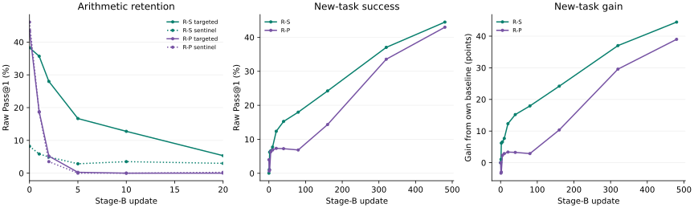

# Replay acquisition-order replication

Run: `replay-order47-20260909T144155Z`.

Contrasts are R-P minus R-S. Intervals are 50,000-resample paired-item trajectory 95% percentile intervals, conditional on each fixed source block. Raw rates and Jeffreys posterior means are reported separately.

## Source block 11 / order seed 47: COMPLETED

| Quantity | R-S | R-P |
|---|---:|---:|
| selected_update | 200 | 140 |
| targeted_raw_retention_auc_0_20 | 0.1499349 | 0.025976562 |
| maps_raw_absolute_auc_0_480 | 0.29602 | 0.23634555 |
| maps_raw_endpoint | 0.44470215 | 0.4296875 |
| maps_raw_baseline | 0.00036621094 | 0.039794922 |
| maps_raw_absolute_auc_0_40 | 0.10888062 | 0.065943909 |
| maps_raw_gain_auc_0_40 | 0.1085144 | 0.026148987 |

| Contrast | Difference | 95% interval |
|---|---:|---| 
| targeted/raw-absolute-AUC-0-20 | -0.12395833 | [-0.14674479, -0.10250651] |
| stage-b/raw-absolute-AUC-0-40 | -0.042936707 | [-0.051141357, -0.035070763] |
| stage-b/raw-gain-AUC-0-40 | -0.082365417 | [-0.092605629, -0.072441101] |
| stage-b/raw-absolute-AUC-0-480 | -0.059674454 | [-0.068300632, -0.051208874] |
| stage-b/raw-baseline | 0.039428711 | [0.033691406, 0.045288086] |
| stage-b/raw-endpoint480 | -0.015014648 | [-0.031616211, 0.0018310547] |

Early gain-AUC difference -0.082365417 = absolute-AUC difference -0.042936707 − baseline difference 0.039428711.

### targeted trajectories

| Update | R-S raw | R-P raw | R-S posterior | R-P posterior |
|---:|---:|---:|---:|---:|
| 0 | 0.3828125 | 0.43489583 | 0.40625 | 0.44791667 |
| 1 | 0.35677083 | 0.1875 | 0.38541667 | 0.25 |
| 2 | 0.27994792 | 0.052083333 | 0.32395833 | 0.14166667 |
| 5 | 0.16666667 | 0.0026041667 | 0.23333333 | 0.10208333 |
| 10 | 0.12760417 | 0 | 0.20208333 | 0.1 |
| 20 | 0.053385417 | 0 | 0.14270833 | 0.1 |
| 40 | 0.028645833 | 0 | 0.12291667 | 0.1 |
| 80 | 0.022135417 | 0 | 0.11770833 | 0.1 |
| 160 | 0.013020833 | 0 | 0.11041667 | 0.1 |
| 320 | 0.0091145833 | 0 | 0.10729167 | 0.1 |
| 480 | 0 | 0 | 0.1 | 0.1 |

### sentinel trajectories

| Update | R-S raw | R-P raw | R-S posterior | R-P posterior |
|---:|---:|---:|---:|---:|
| 0 | 0.08203125 | 0.4609375 | 0.165625 | 0.46875 |
| 1 | 0.05859375 | 0.18619792 | 0.146875 | 0.24895833 |
| 2 | 0.049479167 | 0.03515625 | 0.13958333 | 0.128125 |
| 5 | 0.028645833 | 0 | 0.12291667 | 0.1 |
| 10 | 0.03515625 | 0 | 0.128125 | 0.1 |
| 20 | 0.029947917 | 0.0026041667 | 0.12395833 | 0.10208333 |
| 40 | 0.0078125 | 0 | 0.10625 | 0.1 |
| 80 | 0.0065104167 | 0 | 0.10520833 | 0.1 |
| 160 | 0.0026041667 | 0 | 0.10208333 | 0.1 |
| 320 | 0 | 0 | 0.1 | 0.1 |
| 480 | 0 | 0 | 0.1 | 0.1 |

### stage-b trajectories

| Update | R-S raw | R-P raw | R-S posterior | R-P posterior |
|---:|---:|---:|---:|---:|
| 0 | 0.00036621094 | 0.039794922 | 0.029756434 | 0.066865809 |
| 1 | 0.010986328 | 0.0067138672 | 0.039751838 | 0.035730699 |
| 2 | 0.062255859 | 0.010131836 | 0.088005515 | 0.03894761 |
| 5 | 0.066040039 | 0.063232422 | 0.091567096 | 0.088924632 |
| 10 | 0.077026367 | 0.068481445 | 0.10190717 | 0.09386489 |
| 20 | 0.12353516 | 0.073364258 | 0.14568015 | 0.098460478 |
| 40 | 0.15246582 | 0.072387695 | 0.17290901 | 0.09754136 |
| 80 | 0.17980957 | 0.068603516 | 0.1986443 | 0.093979779 |
| 160 | 0.2421875 | 0.14331055 | 0.25735294 | 0.16429228 |
| 320 | 0.37036133 | 0.33544922 | 0.37798713 | 0.34512868 |
| 480 | 0.44470215 | 0.4296875 | 0.44795496 | 0.43382353 |

R-S F3: [R-S-profile.json](R-S-profile.json).

R-P F3: [R-P-profile.json](R-P-profile.json).

The JSON companion contains per-item counts, own-baseline curves, half-lives, fixed first-attainment rows, early authoritative failure summaries, and final validation counts.

## Scope and definitions

Additional acquisition-order realization on the same 579-example source-block-11 corpus; not a new source block. Original Pilot, replay, and dense-grid observations are unchanged. No pooled comparisons.

Targeted raw-retention AUC over the registered sparse grid [0,1,2,5,10,20], trapezoidally integrated and divided by 20.

Paired whole-item trajectories; within-item draws retained together. Items are exchangeable independent clusters, conditional on selected checkpoints, training realization, families, observed draws and grid. No training-seed or checkpoint-selection uncertainty, family clustering, or multiplicity correction. Half-life intervals withheld if any replicate is undefined or censored; no replicates discarded.

## Descriptive first-crossing half-lives

| Role | Arm / contrast | Updates | Paired item 95% interval |
|---|---|---:|---|
| targeted | R-S | 4.3448276 | [3.5867769, 6.1957088] |
| targeted | R-P | 0.87894737 | [0.78125, 1.0238095] |
| targeted | R-P minus R-S | -3.4658802 | [-5.3027984, -2.7131137] |
| sentinel | R-S | 3.21875 | [1.3, 18.636364] |
| sentinel | R-P | 0.83886256 | [0.75536367, 0.95135135] |
| sentinel | R-P minus R-S | -2.3798874 | [-17.794007, -0.46478382] |
